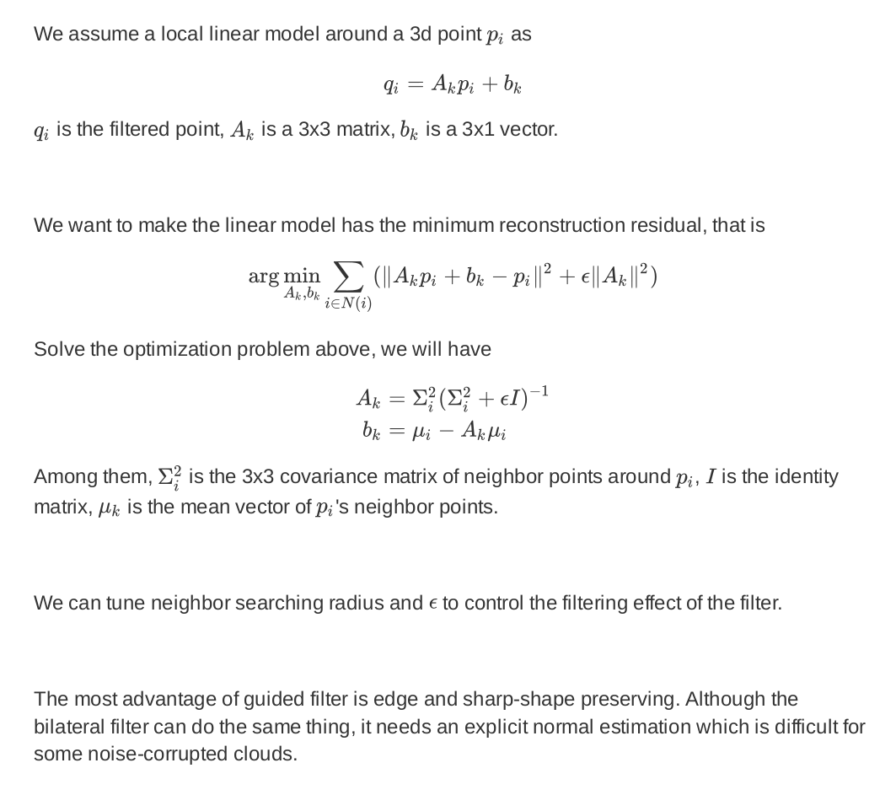
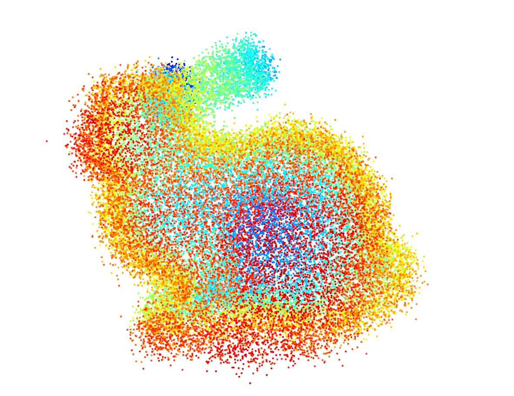
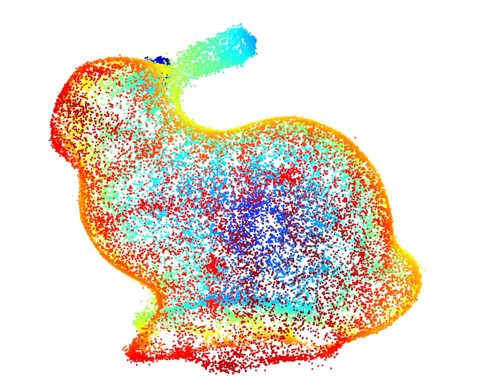

# Point Cloud Denoise

Use guided filter to reduce the noise of point clouds.

## Guided Filter for 3D Points

## Examples
The input noisy point cloud.

The output of the guided filter(run two times).

## References
1. [Guided Image Filtering](http://kaiminghe.com/publications/pami12guidedfilter.pdf)